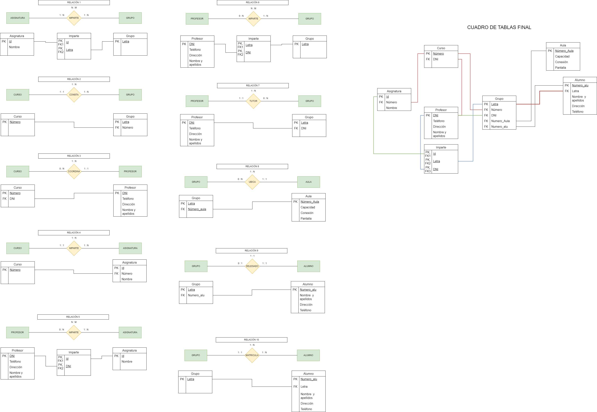

# EXPLICACIONES DEL EJERCICIO DE MODELO RELACIONAL

## Relación 1:
Una relación con cardinalidad N : M siempre va a crear una tabla para cada entidad y una para la relación,
que heredará las claves primarias de las identidades como sus propias claves primarias foráneas.
## Relación 2:
Cuando la cardinalidad es de 1 : N, nos fijamos en las cardinalidades "laterales", y si no hay ningún cero, siempre se formará una tabla por entidad,
y la entidad del lado 1 : 1 le dará su clave primaria a la del lado 1 : N, en concepto de clave foránea.
## Relación 3:
Cuando la cardinalidad es 1 : N y se da que a un lado es 0 : N y a otro 1 : 1, solo se creará una tabla por entidad y,
 la que está del lado del 0 : N recibe la clave primaria de la otra entidad como clave foránea.
## Relación 4:
Cuando la cardinalidad es de 1 : N, nos fijamos en las cardinalidades "laterales", y si no hay ningún cero, siempre se formará una tabla por entidad,
y la entidad del lado 1 : 1 le dará su clave primaria a la del lado 1 : N, en concepto de clave foránea.
## Relación 5:
Una relación con cardinalidad N : M siempre va a crear una tabla para cada entidad y una para la relación,
que heredará las claves primarias de las identidades como sus propias claves primarias foráneas.
## Relación 6:
Una relación con cardinalidad N : M siempre va a crear una tabla para cada entidad y una para la relación,
que heredará las claves primarias de las identidades como sus propias claves primarias foráneas.
## Relación 7:
Cuando la cardinalidad es 1 : N y se da que a un lado es 0 : N y a otro 1 : 1, solo se creará una tabla por entidad y,
 la que está del lado del 0 : N recibe la clave primaria de la otra entidad como clave foránea.
## Relación 8:
Cuando la cardinalidad es 1 : N y se da que a un lado es 0 : N y a otro 1 : 1, solo se creará una tabla por entidad y,
 la que está del lado del 0 : N recibe la clave primaria de la otra entidad como clave foránea.
## Relación 9:
Cuando se da una cardinalidad 1 : 1 y a un lado tenemos 1 : 1 y al otro 0 : 1, cada entidad creará una tabla y
 la tabla del lado 0 : 1 heredará la clave primaria de la otra a modo de clave foránea.
## Relación 10:
Cuando la cardinalidad es de 1 : N, nos fijamos en las cardinalidades "laterales", y si no hay ningún cero, siempre se formará una tabla por entidad,
y la entidad del lado 1 : 1 le dará su clave primaria a la del lado 1 : N, en concepto de clave foránea.
